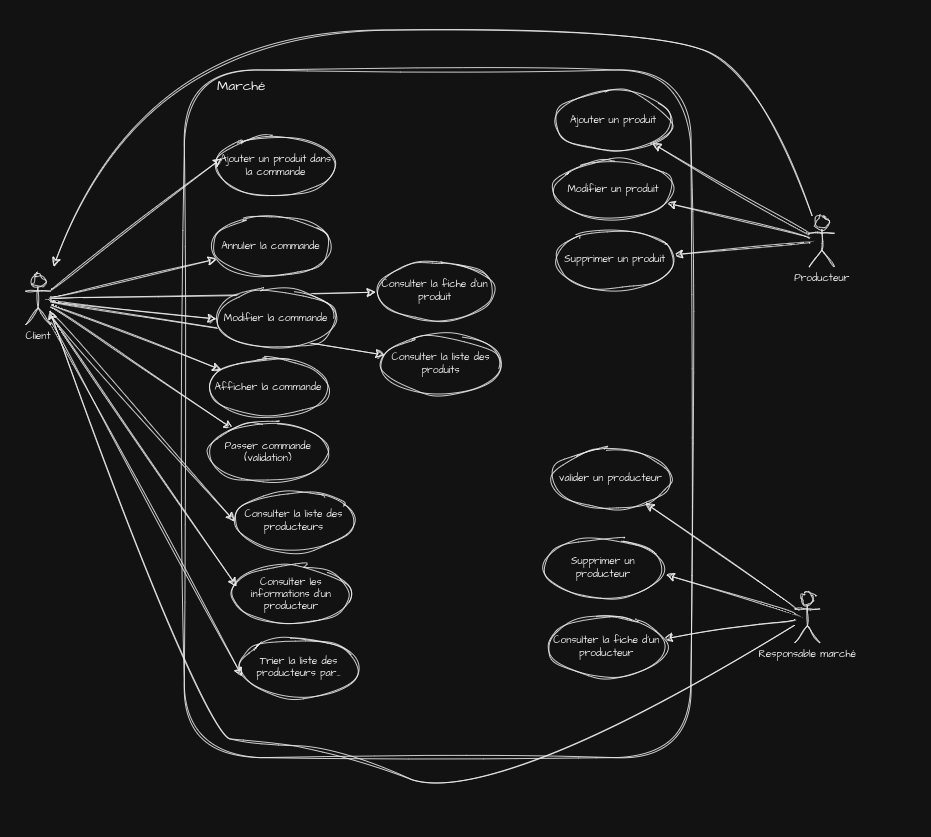

### 1. **Analyse des Besoins**

L'application doit répondre aux besoins des producteurs, des gestionnaires de marché et des clients. Les producteurs 
doivent pouvoir gérer leurs produits, les clients doivent pouvoir passer des commandes, et les gestionnaires de marché doivent pouvoir valider et révoquer les producteurs.  

### 2. **Fonctionnalités Principales**

**Fonctionnalités pour les producteurs :**

- Créer un compte producteur.
- Ajouter, modifier et supprimer des produits.
- Visualiser les commandes passées par les clients.

**Fonctionnalités pour les clients :**

- Créer un compte client.
- Parcourir la liste des produits.
- Ajouter des produits au panier.
- Passer des commandes.
- Visualiser les commandes passées.

### 3. **Conception de l'Interface Utilisateur (UI)**

- Utilisation de react pour créer une interface moderne et dynamique.  

### 4. **Architecture de l'Application**

L'architecture suit une approche orientée objet, avec une séparation claire des préoccupations :
- Design pattern : **N tiers** 

src/main/java/com/app/mfi  
    |-- controller  
    |-- service  
    |-- repository  
    |-- model  
    |-- dto  

###  5. **Technologies Utilisées**

- **Backend** : Java qui est un langage robuste et qui prend en charge les Threads avec Spring boot. 
- **Base de données** : Une base de données relationnelle comme Postgresql pour gérer les relations complexes entre les 
  entités. Utilisation de JDBC et Hibernate pour interagir avec Postgresql.
- **Versionnement** : Utilisation de Git pour versionner le code et gestion du dépôt sur GitHub.
- **Frontend** : React avec typescript... 

### 6. **Sécurité**

- **Authentification et autorisation** : Utilisation de techniques sécurisées pour vérifier et autoriser les utilisateurs (3 niveaux de droit).
- **Hachage des mots de passe** : Sécurisation des mots de passe.

### 7. **Performance et Scalabilité**

- **Optimisation des requêtes** : Utilisation des threads pour de future multiple requete.
- **Scalabilité** : Prévoir la capacité d'ajouter facilement des producteurs, des clients et des produits supplémentaires sans compromettre les performances.

Justification d'un Choix :

- **Choix de séparer les entités Client et Producer** : Cette séparation permet de gérer distinctement les 
  fonctionnalités et les autorisations spécifiques à chaque type d'utilisateur. Par exemple, les clients passent des 
  commandes, tandis que les producteurs gèrent les produits. Cette distinction améliore la clarté et la maintenance du code.  

### Analyse du Diagramme de Classe :

- **Client** : Entité représentant un client avec une liste de commandes.
- **Order** : Contient les détails de la commande, comme la date, les produits, et le client propriétaire.
- **Product** : Représente un produit avec des attributs détaillés et des méthodes pour gérer les images associées.
- **Producer** : Contient des informations spécifiques au producteur, comme le SIRET, le mot de passe haché, le téléphone, les produits et le statut.
- **Item** : regroupe les lignes de commandes contenus dans une commande.
